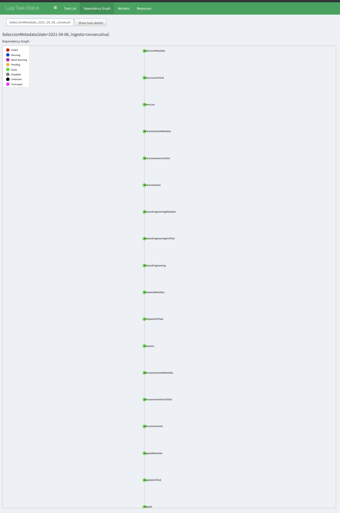
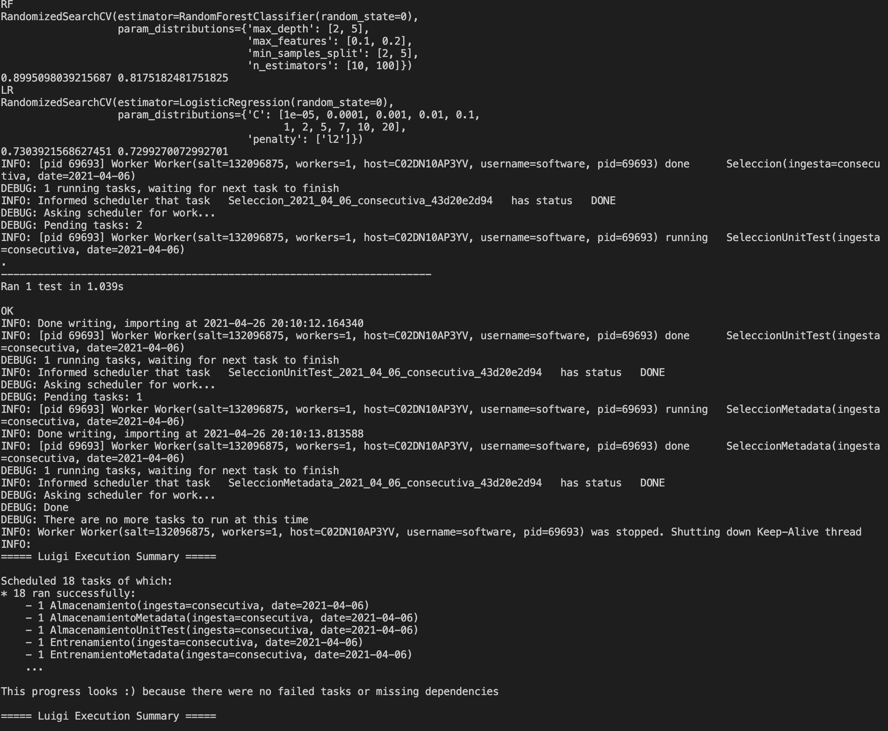

# Proyecto DPA

## Integrantes del equipo

* Sergio Sánchez Reyes
* Fernanda Tellez Girón
* Pedro Latapi
* Oscar Allan Ruiz Toledo

## Setup

**Versión de Python:** >= 3.7.0

Es altamente recomendable crear un [ambiente virtual](https://docs.python.org/3/library/venv.html) para evitar problemas en las dependencias. 

### Instalación

Para instalar todas las dependencias del proyecto correr el siguiente comando en la raíz del proyecto:

```bash
pip install -r requirements.txt
```

## Datos a utilizar

* Fuente : 'https://data.cityofchicago.org/Health-Human-Services/Food-Inspections/4ijn-s7e5/data'
* Número de registros : 215,026
* Número de columnas : 17

## Variables

* Inspection ID : ID de la inspección.
* DBA NAME : (Doing Business As) Nombre del establecimiento
* AKA NAME : (Also known as) Nombre alternativo del establecimiento
* License # : Número de licencia 
* Facility Type : Tipo de establecimiento
* Risk : Nivel de riesgo asociado
* Address : Dirección
* City : Ciudad
* State : Estado
* Zip : Código Postal
* Inspection Date : Fecha de inspección
* Inspection Type : Tipo de inspección
* Results : Resultado de la inspección
* Violations : Violaciones detectadas
* Latitude : Latitud 
* Longitude : Longitud
* Location : Ubicación

**Frecuencia de actualización:** Diaria

## Problema 

¿Es posible predecir el resultado de una inspección sanitaria y cuales son los drivers de estos resultados?


## EDA

En la carpeta `notebooks/eda` podrás encontrar un análsis exploratorio de los datos.

Para la correcta visualización del notebook **EDA_foof_inspections.ipynb** es necesario actualizar
la variable `PATH` con la ruta en la que se encuentran el archivo **Food_Inspections.csv**


## Corriendo los tasks en Luigi

Antes iniciar hay que crear un archivo [Yaml](https://yaml.org/) en la carpeta `conf/local` que tenga la siguiente estructura:

```yaml
s3:
  aws_access_key_id: your_access_key_id
  aws_secret_access_key: your_secret_key
food_inspections:
  api_token: your_socrata_app_token
db:
  user: your_postgres_user
  pass: yout_postgres_pass
  database: your_postgres_db
  host: your_postgres_db_host
  port: your_postgres_db_port
```

El nombre del archivo deberá ser `credentials.yml`.

### Esquema de base de datos

Para los tasks de metadata es necesario correr el script de SQL que se encuentra en `sql/create_metadata_tables.sql` para crear la estructura necesaria para almacenar la metadata.

### Instalación

Instalar las dependencias de tu virtual environment

```bash
pip install -r requirements.txt
```

Nota: La dependencia `psycopg2` tiene algunos prerequisitos que se pueden consultar [aquí](https://www.psycopg.org/docs/install.html#installation)

### Iniciar servidor de Luigi

Para iniciar el servidor de Luigi, se debe correr el siguiente comando

```bash
sudo luigid --background
```

También se puede iniciar con

```bash
luigid
```

A partir de este momento ya se puede acceder desde tu navegador a la interfaz gráfica de Luigi en la dirección http://localhost:8082

### Ejecutar tasks

Para ejecutar todos los tasks, correr el siguiente comando en la raíz del proyecto

```bash
PYTHONPATH='.' luigi --module src.pipeline.luigi.seleccion_metadata SeleccionMetadata --ingesta consecutiva --date "2021-04-06"
```

Los parámetros de los tasks son `ingesta` y `date`, los valores posibles para `ingesta` son `inicial` y `consecutiva`. El formato de la fecha es `Y-m-d`. Esto correra los 18 tasks en caso de ser necesario.





### Nota

Los scripts ejemplos se deben correr en la raíz del proyecto. El proyecto está configurado esperando que el usuario tenga un bucket llamado **data-product-architecture-equipo-2**. En caso de necesitar modificar una variable como la ubicación del archivo `credentials.yml` o el nombre del bucket, éstas se encuentran en el archivo `src/utils/constants.py`
